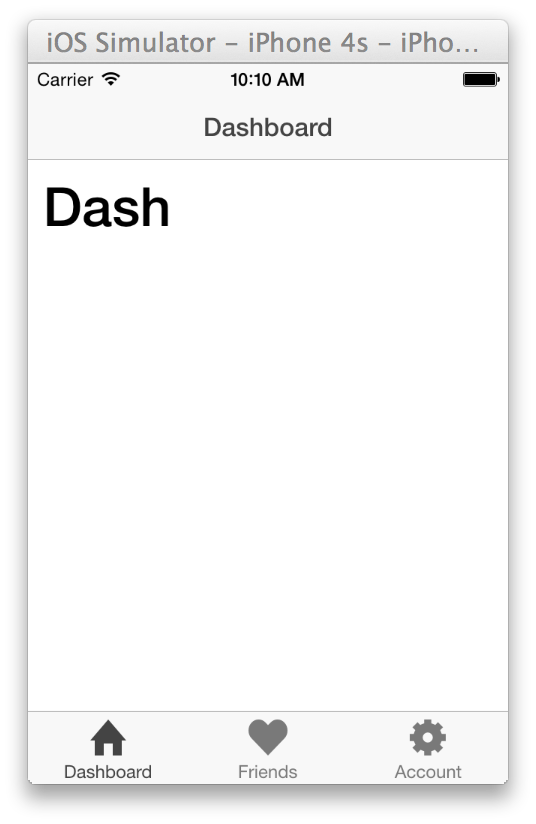

ionic-boot
==========

# Introduction
Creating a high-performance, cross-platform mobile app with a high-fidelity native look and feel can be
an intimidating task.

# Set Up
## Install node, cordova, ionic
[Installing Ionic and its Dependencies](http://ionicframework.com/docs/guide/installation.html)

Install node

```
$ npm install -g cordova
```

```
$ npm install -g ionic
```

## The App

```
Code
```

## Getting Started

### Initialize the app

```
$ ionic start IonicGram

$ cd IonicGram

$ ionic platform ios

$ ionic platform android
```

### Add hooks

Add hook to ensure that anyone checking out this project will have the proper cordova plugins.

[Cordova Hooks for Plugins](http://devgirl.org/2013/11/12/three-hooks-your-cordovaphonegap-project-needs/)

### Share



## Frame In

Application Layout

[Global Side Menu]

[Tabbed Profile View]
 tabs


## Online

## Offline

## References

